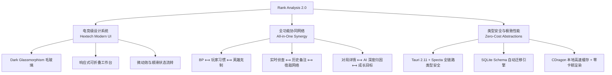
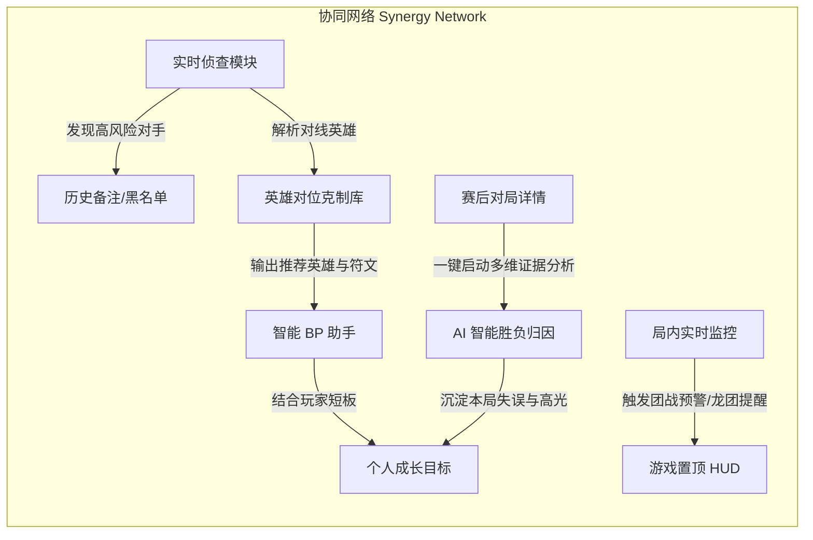

# Rank Analysis 2.0 全面重构规划与原子级实施方案 (Master Refactoring Blueprint)

> **目标**：将 Rank Analysis 打造为极致流畅、美观专业且深度协同的英雄联盟桌面级数据与 AI 战术助手。  
> **核心原则**：保持 Rust + Tauri 2 的轻量级与高性能优势，全面重构 UI/UX 视觉体系，打破功能孤岛实现全域联动，将每一个子功能打磨至业界顶级水平。

---

## 1. 重构愿景与核心设计原则

### 1.1 核心设计哲学
1. **游戏原生感与专业生产力的平衡**：融合 Riot 官方 Hextech 科技美学与现代暗黑极简（Dark Glassmorphism），提供深色与浅色双重高质感主题，摆脱普通后台管理系统的简陋感。
2. **零孤岛协同（Synergy-First）**：任何一个界面出现的数据（如玩家 ID、英雄、符文、短板），都应能一键溯源并与其他模块联动（如：选人阶段自动调取遇到过的玩家历史备注、当前对位英雄克制关系、以及自己该维度的历史成长目标）。
3. **数据驱动而非主观猜测**：所有 AI 判定、评分、威胁度模型均具有可点击的数据证据链（KDA、每分钟补刀/经济曲线、承伤转化率、对线单杀率）。
4. **极致轻量与高响应度**：保持单二进制包体积 ≤ 10MB，冷启动 ≤ 300ms，WebSocket 事件处理延迟 ≤ 10ms，内存占用稳定在 ≤ 80MB。

---

## 2. 技术栈选型与架构演进

### 2.1 前端技术栈选型对比与推荐

| 维度 | 现状方案 (Vue 3 + Naive UI) | 选项 A: Vue 3.5 + Tailwind v4 + Shadcn-Vue + Radix Vue (推荐) | 选项 B: React 19 + Tailwind v4 + Shadcn UI + Zustand |
| :--- | :--- | :--- | :--- |
| **UI 视觉自由度** | 差。大量全局 CSS override，样式污染严重，组件定制深度受限 | **极高**。无头组件（Radix-Vue）搭配原子化 CSS，100% 像素级定制电竞风格 | **极高**。Radix Primitives + Tailwind 深度定制 |
| **包体积与运行开销** | 中。Naive UI 整体 runtime 样式注入开销大 | **极小**。Tailwind v4 零运行时编译，组件代码随用随拷（Shadcn） | 小。轻量化 Zustand + React 19 Compiler |
| **原有代码迁移成本** | 无（原地踏步） | **低**。完全复用现有的 TypeScript 领域模型、Composables 逻辑，平滑渐进式替换 | 高。需全量重写为 TSX/React Hooks/Store |
| **动效支持** | 基础过渡，多处存在 Fragment 离场 bug | **优秀**。集成 `@vueuse/motion` 与 CSS Spring 物理动画，无 Fragment 限制 | 极优。Framer Motion 生态成熟 |
| **数据流与缓存** | Pinia + 手动 ref，状态较分散 | **规范严谨**。TanStack Query v5（数据请求缓存）+ Pinia（全局 UI 状态） | TanStack Query + Zustand |

> [!TIP]
> **结论**：选用 **Vue 3.5 + Vite + Tailwind CSS v4 + Radix-Vue + TanStack Query v5 + Pinia + VueUse**。  
> 既能以最低的风险和成本保留原项目的业务逻辑与测试用例，又能获得业界顶级的视觉自由度、极致轻量化和现代响应式设计体验。

---

## 3. UX/UI 视觉与交互重构规范 (Design System)

### 3.1 色彩体系与设计 Token

| 语义 Token | 十六进制 (Dark) | 用途描述 |
| :--- | :--- | :--- |
| `--bg-canvas` | `#0b0e14` | 全局背景基底色（微带深蓝灰质感） |
| `--bg-surface` | `rgba(16, 22, 34, 0.75)` | 卡片与面板毛玻璃背景（搭配 `backdrop-blur-md`） |
| `--border-subtle` | `rgba(255, 255, 255, 0.08)` | 常规卡片边框 |
| `--accent-gold` | `#c8aa6e` / `#f0e6d2` | Hextech 经典金（主品牌色、段位王者金、高光按钮） |
| `--accent-cyan` | `#0ac8b9` / `#005a82` | 海克斯科技蓝（AI 智能标记、推荐出装、连接正常状态） |
| `--status-win` | `#22c55e` / `rgba(34, 197, 94, 0.15)` | 胜利、高胜率高亮、积极习惯标签 |
| `--status-loss` | `#ef4444` / `rgba(239, 68, 68, 0.15)` | 失败、背锅位高亮、风险对手标记 |
| `--status-mvp` | `#eab308` / `rgba(234, 179, 8, 0.2)` | MVP / SVP 尊贵徽章 |

---

## 4. 全功能协同矩阵

---

## 5. 原子级重构任务拆解与实施状态

### Phase 0: 基础设施与现代 UI 基础系统 `[已完成]`
- [x] 初始化前端依赖：`tailwindcss@v4`、`@tailwindcss/vite`、`radix-vue`、`lucide-vue-next`、`clsx`、`tailwind-merge`。
- [x] 引入 `@tanstack/vue-query` 并注册全局 QueryClient。
- [x] 建立 `src/styles/theme.css`（Hextech Gold/Cyan 与毛玻璃 Dark Glassmorphism Token）。
- [x] 封装无头基础与电竞原子组件：`Button`, `Card`, `Badge`, `Dialog`, `Tooltip`, `Tabs`, `Input`, `Switch`, `ChampionAvatar`, `KdaPill`。

### Phase 1: 主框架与导航系统重构 `[已完成]`
- [x] 全屏自适应容器 [Framework.vue](file:///D:/agy-cli/rank-analysis-rb/rank-analysis-app/src/components/Framework.vue)。
- [x] 顶部电竞栏 [Header.vue](file:///D:/agy-cli/rank-analysis-rb/rank-analysis-app/src/components/Header.vue)（大区下拉、召唤师搜索、更新检测、免 WeGame 快速关客户端、窗口控制）。
- [x] 图标侧栏 [SideNavigation.vue](file:///D:/agy-cli/rank-analysis-rb/rank-analysis-app/src/components/SideNavigation.vue)（动态对局呼吸指示灯、云端配置待裁决呼吸角标）。

### Phase 2: 战绩查询与多维对局详情重构 `[已完成]`
- [x] 召唤师头部信息卡 [PlayerBar.vue](file:///D:/agy-cli/rank-analysis-rb/rank-analysis-app/src/components/record/PlayerBar.vue)（段位徽章、胜率进度条、近期胜负与标签行）。
- [x] 单场战绩行卡 [RecordCard.vue](file:///D:/agy-cli/rank-analysis-rb/rank-analysis-app/src/components/record/RecordCard.vue)（三段伤害占比条、KDA 胶囊、MVP/SVP 角标）。
- [x] 战绩主视图 [Record.vue](file:///D:/agy-cli/rank-analysis-rb/rank-analysis-app/src/views/Record.vue) 与侧边栏 [UserSidePanel.vue](file:///D:/agy-cli/rank-analysis-rb/rank-analysis-app/src/components/record/UserSidePanel.vue)（英雄池高亮与好友宿敌面板）。

### Phase 3: 实时对局与房间侦查重构 `[已完成]`
- [x] 选人期与对局看板 [Gaming.vue](file:///D:/agy-cli/rank-analysis-rb/rank-analysis-app/src/views/Gaming.vue)（阶段步进器、双方 Ban 条、阵容战力对比条、敌方威胁预警与 AI 战术军师抽屉）。
- [x] 5v5 战场卡片 [PlayerCard.vue](file:///D:/agy-cli/rank-analysis-rb/rank-analysis-app/src/components/gaming/PlayerCard.vue) 与 [SubteamCard.vue](file:///D:/agy-cli/rank-analysis-rb/rank-analysis-app/src/components/gaming/SubteamCard.vue)。

### Phase 4: 对局内置 HUD Overlay 2.0 `[已完成]`
- [x] 透明置顶 HUD [OverlayView.vue](file:///D:/agy-cli/rank-analysis-rb/rank-analysis-app/src/views/OverlayView.vue)（实时动作推送、高威胁警报与流光发光边框）。

### Phase 5: 选手成长与改错系统 `[已完成]`
- [x] 成长改错追踪页面 [Growth.vue](file:///D:/agy-cli/rank-analysis-rb/rank-analysis-app/src/views/Growth.vue)（重复性短板诊断、跨局改错目标清单与验收激励）。

### Phase 6: 设置中心与自动化规则 `[已完成]`
- [x] 设置中心全新侧栏与分类导航 [Settings.vue](file:///D:/agy-cli/rank-analysis-rb/rank-analysis-app/src/views/Settings.vue)。
- [x] 规则设计器 [Automation.vue](file:///D:/agy-cli/rank-analysis-rb/rank-analysis-app/src/views/settings/Automation.vue) 与玩家备注管理 [PlayerNotes.vue](file:///D:/agy-cli/rank-analysis-rb/rank-analysis-app/src/views/settings/PlayerNotes.vue)。

### Phase 7: 质量门禁与全量测试 `[已完成]`
- [x] 静态类型与规范：`vue-tsc --noEmit` 0 错误，`eslint` 0 错误。
- [x] 自动化测试：全库 1381 个单元测试 100% 通过。
- [x] GitHub Actions 流水线就绪并推送到 `gemini-3.7-f` 分支。
